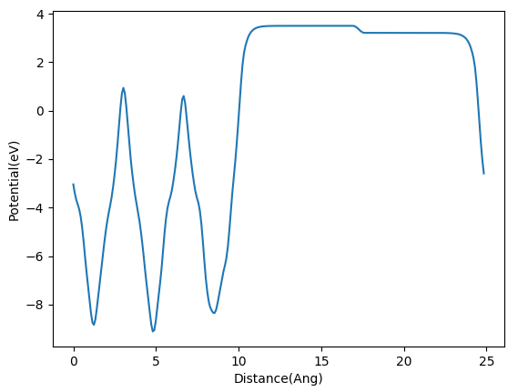

## Core ideas in the Q-robot：

1)  We treat the robot as a friend who can be easily updated to higher version;

2)  The action folder has all functions that can be imported for further specific tasks.

3) There are four ways to update the Q-robot:

* update the brain modules
* Feed more books to Q-robot (enrich the database)
* update the actions
* call help from friends (codes from other intelligent guys )


## How to activate  it

Step-1） Uncompress the tar file and move the Q-robot folder to the ~/bin file 

step-2-A） edit the `~/.bashrc` file and add the line below:

```bash
####evoke Q-robot
export PATH=$PATH:/home/qli/bin/Q_robot/actions
export PATH=$PATH:/home/qli/bin/Q_robot/friends/vtst/vtstscripts-937
export PYTHONPATH=/home/qli/bin/Q_robot/brain
```

Notes:

* change `qli` to the user name of your computer, if you do not know, in the terminal, type:

  ```bash
  qli@p015:~$ whoami
  qli
  qli@p015:~$
  ```

* `Q_robot` is the folder contains all functions.

* Or you can replace `/home/qli` with `$HOME`

```bash
####evoke Q-robot
export PATH=$PATH:$HOME/bin/Q_robot/actions
export PATH=$PATH:$HOME/bin/Q_robot/friends/vtst/vtstscripts-937
export PYTHONPATH=$HOME/bin/Q_robot/brain
```

step2-B） In Marenostrum, we have to load the python module first, so we need to add the following lines to `~/.bashrc` file. 

```bash
####evoke Q-robot
module load python/2.7.14
export PATH=$PATH:$HOME/bin/Q_robot/actions
export PYTHONPATH=$HOME/bin/Q_robot/brain
```

or add only one line:

```bash
####evoke Q-robot
source $HOME/bin/Q_robot/brain/get_up.sh
```

* get_up.sh has the same information as above, this method is suggested by Sergio.

## Basic Introductions

There are four parts (folders) in the Q-robot：

* 1) the brain；
* 2) the actions, 
* 3) books, 
* 4) friends
* 5) reports.

1） Brain

The brain folder has all function modules for VASP input and output files, by importing these functions, we can write our own scripts for specific usages. Following are the basic information of these modules.

| VASP IN_OUTPUTS | Modules             | Folder  |
| --------------- | ------------------- | ------- |
| INCAR           | in.py               | brain   |
| KPOINTS         | kpoints.py          | brain   |
| POSCAR/CONTCAR  | lattice.py          | brain   |
| POTCAR          | potcar.py           | brain   |
| vasprun_script  | queue.py            | brain   |
| OUTCAR          | outcar.py           | brain   |
| DOSCAR          | doscar.py           | brain   |
| EIGENVAL        | eigenval.py         | brain   |
| XDATCAR         | xdatcar.py          | brain   |
| vasprun.xml     | vasprun_xml.py      | brain   |
| Job_control     | job.py; queue.py    | brain   |
| Database        | data.py             | brain   |
| CHG/CHGCAR      | get_bader.py        | actions |
| LOCPOT          | vtotav.py; wplot.py | actions |

* Note: `vtotav.py` is from [ASE_tools](https://github.com/compphys/ase_tools/blob/master/scripts/vtotav.py) 

2) Actions

Actions, are the specific scripts we used in our daily work, in other words, the frequent orders/commands we ask the Q-robot to execute.

| Script_name    | Tasks                                                        |
| -------------- | ------------------------------------------------------------ |
| in.py          | To generate the INCAR file                                   |
| d2-dict.py     | To add the DFT-D2 parameters to INCAR. The same as:  in.py dftd2 |
| dftu.py        | To add the DFT+U parameters to INCAR.  The same as command: in.py dftu |
| kp.py          | To generate the KPOINTS file from POSCAR or your inputs      |
| kpoints.sh     | To generate the KPOINTS file: A bash script from Rodrigo     |
| pp.py          | To generate the POTCAR from POSCAR or your inputs            |
| check.py       | To generate the BSC and Tekla2 VASP_run scripts; return the job path from job-ID; check the job status: finish or not, is there convergence problems. |
| ent            | To get into the job path directly: An Alias command in ~/.bashrc file |
| bm.py          | To fit the BM state equations and get the lattice parameter. |
| add.py         | To copy atom(s) from one POSCAR to another                   |
| cssm.py        | To cleave the stable surfaces of metals: based on ASE modules |
| dcenter.py     | To calculate the d-band center                               |
| delete.py      | To delete atom(s) from POSCAR/CONTCAR                        |
| dire2cart.py   | To convert the Direct to Cartesian Coordinates; Fix the specific layers from inputs |
| dos_extract.py | To extract the specific dos information. (Whatever combinations you like) |
| entropy.py     | To calculate the entropy and Zero Point Energy (ZPE) from frequency calculations |
| fix_atoms.py   | To fix and relax the atoms by your inputs                    |
| get_abc.py     | To get the vector, length of our models                      |
| get_bader.py   | To calculate the Bader Charges from the VTST outputs and ZVAL from POTCAR |
| get_bandgap.py | To calculate the band gap from  EIGENVAL file                |
| get_mag.py     | To get the magnetization of atoms from your inputs           |
| move_atoms.py  | To copy the atoms from one POSCAR to another, similar to copy.py |
| rotate.py      | To rotate the atoms any degrees around the axis from your input |
| pbekpoints.py  | To generate the points from the KPOINTS with line mode, the output is k_add |
| pbeband.py     | To generate the data for plotting the band structure from GGA-PBE |
| hsekpoints.py  | To generate the KPOINTS file for HSE-band structure calculations. |
| hseband.py     | To generate the data for plotting the band structure from HSE |
| sortcar.py     | To sort the coordinates of each element in the z directions  |
| switch.py      | To get all the possibilities of switching two atoms from two layers; for segregation calculations |
| translate.py   | To shift, translate or move atoms in the POSCAR file         |
| vtotav.py      | To generate the LCOPOT_Z file to plot the workfunction       |
| xps.py         | To move the atom at the very beginning in POSCAR for XPS calculations. |


3) books

In the books file, there are some basic database, the information of these books are stored in the data.py module in brain. so far, the Q-robot has already read books：

*  VASP pseudopotentials;
* DFT-D2 parameters: C6 and R0 values;
* Some Metal bulk lattice parameters 

You can help it to read more books, the core ideas here are:

* you converts the information in the books to the data.py file in a dictionary format;
* Import the data.py for future usage.

4) Friends

Sometimes, we don't have enough time to finish the codes for some tasks and there are some guys have already done them and these codes are freely to use, so we borrow them from our friends. For example:

* ASE
* VTST
* VASPKIT

5） Reports

The reports folder has the outputs from Q-robot. Generally, they are the basic information about our jobs.

So we can use them and read them to facilitate our daily work and improve the efficiency.


## Detail Usages

In this part, we follow the sequence of: `INCAR`, `KPOINTS`, `POTCAR`, `vasprun_scripts`, `POSCAR` and outputs operations.

### INCAR (in.py)

1) If you do not know how to use `in.py`, use command: `in.py sdf^sdof` (any nonsense characters) ; add what any weird arguments after in.py command. See the example:  

```fortran
qli@p015:~/test$ in.py XXX 
POSCAR Not Found. Becareful about the D2, DFT+U parameters
Please use the keywords to specify your tasks:

['md', 'b3lyp', 'single', 'pbe0', 'hse03', 'dimer', 'hse06', 'dftd3', 'hf', 'electronic', 'optb88', 'optb86b', 'dftu', 'dos', 'neb', 'dftd2', 'gas', 'vdwdf2', 'bulk', 'optpbe', 'freq', 'vdwdf', 'tsopt', 'scan+rvv10', 'rvdwdf2', 'ispin', 'workfunction']

Common used inputs are: 

electronic, dftd2, dftd3, ispin, dftu, tsopt, neb, dimer, freq

qli@p015:~/test$ 
```


2)  Now we know that to generate the INCAR files, we need to type: `in.py  tasks`. Before we talk about the tasks, lets type `in.py` directly. 

```fortran
qli@p015:~/test$ ls
qli@p015:~/test$ in.py 
POSCAR Not Found. Becareful about the D2, DFT+U parameters
qli@p015:~/test$ ls
INCAR 
qli@p015:~/test$ cat INCAR  
#SYSTEM
SYSTEM = Generated By Q_robot 

#ELEC
ISPIN = 1 
EDIFF = 1E-05 
NELM = 60 
LREAL = AUTO 
ENCUT = 450 

#WRITE
LVHAR = F 
LCHARG = F 
LELF = F 
NWRITE = 0 
LWAVE = F 
LORBIT = 11 

#ISMEAR
ISMEAR = 0 
SIGMA = 0.10 

#DIPLOLE
LDIPOL = T 
IDIPOL = 3 

#IONIC
ISYM = 2 
ISIF = 2 
IBRION = 2 
EDIFFG = -0.03 
POTIM = 0.10 
NSW = 500 

#START
ICHARG = 2 
GGA = PE 
ISTART = 0 
PREC = N 

```

So, now we konw two things: 

* in.py will check if POSCAR exist or not as some parameters （DFTD2，DFT+U）are closely relative with this file
* the default outputs are  the basic inputs for surface related optimizations. 

3) If you want to calculate the frequency, type: `in.py freq`

```fortran
qli@p015:~/test$ in.py freq
POSCAR Not Found. Becareful about the D2, DFT+U parameters
qli@p015:~/test$ tail -n 6 INCAR  
#CAL_FREQ 
EDIFF = 1E-7 
IBRION = 5 
NFREE = 2 
POTIM = 0.015 
NWRITE = 2 
```

4） if you want to calculate：

* frequency 
* DFTD2 
* switch on the ISPIN

 Use command： `in.py freq dftd2 ispin`

5)  In many cases, for example, we used `dftd2` and `ispin` for all the calculations and we do not want to type them every time before we launch the calculations. Here is a trick:

```fortran
alias incar='in.py dftd2 ispin '
```

So you can type: `incar freq` to get the same INCAR as in the step 4).

6) There is another way to avoid repeating arguments every time. Since Q-robot is a DIY robot. You can also design or create your own default or task INCAR parameters by modifying the `incar.py` in brain folder. Open `incar.py` file, you can find a dictionary called `standard_incar`, following the same formats and add your own parameters for default outputs.

```python
d_XXX： {'Parameter1' : 'Value1', 'Parameter2' : 'Value2' },
```

* do not forget the `d_` and `,` on the two sides.

Add the parameters to `tasks_incar` dictionary will help you to generate your specific task parameters. 

```python
d_cal_XXX： {'Parameter1' : 'Value1', 'Parameter2' : 'Value2' },
```

*  do not forget the `d_cal` and `,` on the two sides.

7) `in.py neb` will generate the `INCAR` for NEB calculations, Q-robot will read the images first and update the IMAGES parameter accordingly.


### KPOINTS （kp.py）

Following are some examples to use the `kp.py` script.

```fortran
qli@p015:~/test$ kp.py 

Q-robot did not find the POSCAR file.
Q-robot did not find the KPOINTS file.

A 3 3 1 KPOINTS will be generated by default!

Gamma Centered KPOINTS have been Generated: 3 3 1

qli@p015:~/test$ cat KPOINTS  
K-POINTS Generated By Q-Robot
0
Gamma
3 3 1
0 0 0
qli@p015:~/test$ kp.py 1

 Command usages: 

 1) To generate KPOINTS by using Q-robot:	 kp.py 

 2) To generate specified KPOINTS of 3 3 1:	 kp.py 3 3 1
 
qli@p015:~/test$ kp.py 5 5 1 

Gamma Centered KPOINTS have been Generated: 5 5 1

qli@p015:~/test$ qli@p015:~/test$ cat KPOINTS  
K-POINTS Generated By Q-Robot
0
Gamma
5 5 1
0 0 0

qli@p015:~/test$ cp ~/Desktop/robot_test/POSCAR .
qli@p015:~/test$ ls
INCAR KPOINTS POSCAR
qli@p015:~/test$ kp.py  1 1 1 

Gamma Centered KPOINTS have been Generated: 1 1 1

 K:   	    1      1      1

a:   	 10.485  11.633  24.838

K*a: 	 10.485  11.633  24.838

Too small K*a value is found
Too small K*a value is found
Too small K*a value is found
          
From: https://wiki.fysik.dtu.dk/gpaw/exercises/surface/surface.html 
A rule of thumb for choosing the initial k-point sampling is, 
that the product, k x a, 
between the number of k-points, k, in any direction, 
and the length of the basis vector in this direction, a, 
should be:
    ka ~ 30 $\AA$, for d band metals
    ka ~ 25 $\AA$, for simple metals
    ka ~ 20 $\AA$, for semiconductors
    ka ~ 15 $\AA$, for insulators

```


* By Default, 1) $\Gamma$-centered; 2) 3x3x1 KPOINTS file will be generated 
* You can generate 5x5x1 KPOINTS by using: `kp.py 5 5 1`
* If your KPOINTS are too small, `kp.py` will complain a little bit.


### POTCAR（pp.py）

Following are three cases to run `pp.py` script:

```fortran
qli@p015:~/test$ cp ~/Desktop/robot_test/POSCAR .
qli@p015:~/test$ ls
INCAR  KPOINTS  POSCAR  
qli@p015:~/test$ 
qli@p015:~/test$ pp.py 

Add Ti to the POTCAR

Add O to the POTCAR

Add P to the POTCAR

%%%%%%%%%%%%%%%%%%%%%%%%% POTCAR Information %%%%%%%%%%%%%%%%%%%%%%%%%

NAME	DATE		N_ELE	ENMAX	MASS	TYPE	E_STATE
Ti	08Apr2002	4.000	178.330	47.880	PAW_PBE	Ti: d3 s1
O	08Apr2002	6.000	400.000	16.000	PAW_PBE	O: s2p4
P	06Sep2000	5.000	255.040	30.974	PAW_PBE	P : s2p3

%%%%%%%%%%%%%%%%%%%%%%%%%%%%% Good Luck! %%%%%%%%%%%%%%%%%%%%%%%%%%%%%

qli@p015:~/test$ rm POSCAR  
qli@p015:~/test$ ls
INCAR  KPOINTS  POTCAR
qli@p015:~/test$ pp.py 
%%%%%%%%%%%%%%%%%%%%%%%%%%%%%%%%%%%%%%%%

WARNING!!! No POSCAR in current folder!!

WARNING!!! No POSCAR in current folder!!

%%%%%%%%%%%%%%%%%%%%%%%%%%%%%%%%%%%%%%%%

%%%%%%%%%%%%%%%%%%%%%%%%% POTCAR Information %%%%%%%%%%%%%%%%%%%%%%%%%

NAME	DATE		N_ELE	ENMAX	MASS	TYPE	E_STATE
Ti	08Apr2002	4.000	178.330	47.880	PAW_PBE	Ti: d3 s1
O	08Apr2002	6.000	400.000	16.000	PAW_PBE	O: s2p4
P	06Sep2000	5.000	255.040	30.974	PAW_PBE	P : s2p3

%%%%%%%%%%%%%%%%%%%%%%%%%%%%% Good Luck! %%%%%%%%%%%%%%%%%%%%%%%%%%%%%

qli@p015:~/test$ rm POTCAR 
qli@p015:~/test$ ls
INCAR  KPOINTS    
qli@p015:~/test$ pp.py 
%%%%%%%%%%%%%%%%%%%%%%%%%%%%%%%%%%%%%%%%

WARNING!!! No POSCAR in current folder!!

WARNING!!! No POSCAR in current folder!!

%%%%%%%%%%%%%%%%%%%%%%%%%%%%%%%%%%%%%%%%

But you can generate POTCAR by using command: pp.py element1 element2 ....

qli@p015:~/test$ pp.py Ti O P 
%%%%%%%%%%%%%%%%%%%%%%%%%%%%%%%%%%%%%%%%

WARNING!!! No POSCAR in current folder!!

WARNING!!! No POSCAR in current folder!!

%%%%%%%%%%%%%%%%%%%%%%%%%%%%%%%%%%%%%%%%

Add Ti to the POTCAR

Add O to the POTCAR

Add P to the POTCAR

%%%%%%%%%%%%%%%%%%%%%%%%% POTCAR Information %%%%%%%%%%%%%%%%%%%%%%%%%

NAME	DATE		N_ELE	ENMAX	MASS	TYPE	E_STATE
Ti	08Apr2002	4.000	178.330	47.880	PAW_PBE	Ti: d3 s1
O	08Apr2002	6.000	400.000	16.000	PAW_PBE	O: s2p4
P	06Sep2000	5.000	255.040	30.974	PAW_PBE	P : s2p3

%%%%%%%%%%%%%%%%%%%%%%%%%%%%% Good Luck! %%%%%%%%%%%%%%%%%%%%%%%%%%%%%

```

* When there exist a POSCAR file, pp.py can generate the POTCAR accordingly;
* If there is POTCAR but no POSCAR, pp.py will print the information of current POTCAR;
* if there is No POTCAR and POSCAR, it will inform you to generate by hand;
* `pp.py A B C` will generate a POTCAR containing A, B, C elements.


### vasprun_scripts (check.py)

check.py can do a few things:

1) To generate the vasprun scripts both in Marenostrum and Tekla2. 

* To generate the vasp_run scripts  in tekla2, at least two arguments are needed. 

  ```
  check.py A B C
  ```

  * A will be the queue you want to use， A is the string,  can be c4, c8, c12, c24, c28.
  * B will be the number of cores you want to use.  If you use 28 cores for c24 queue, the 28 will be changed to 24 automatically.
  * C will be job name, if you do not input, the job_name by default is: Q-robot.

* To generate the vasp_run scripts in BSC (Marenostrum). At least one argument is needed.

  ```
  check.py B C
  ```

  * B is the  number of cores you would like to use in BSC. B is the inter numbers, can be 24 * N
  * C will be the job_name, if you do not input, the job_name by default is: Q-robot.

  * if you type: check.py 24 24, both run_vasp_tekla and run_vasp_bsc will be generated.

2) To check if your jobs is finish or not? converged or not. For example:

```fortran
qli@p015:~/Desktop/robot_test$ ls
CONTCAR   DOSCAR  KPOINTS    OSZICAR    POSCAR  XDATCAR IBZKPT OUTCAR REPORT        run_vasp_tekla INCAR  p4vasp.log POTCAR  run_vasp_bsc  sub12 vasprun.xml
qli@p015:~/Desktop/robot_test$ check.py 
NSW_INCAR:	 500 	 NSW_OSZICAR:	 14 	 Converge:	 Yes 	 Finish:	 Yes
qli@p015:~/Desktop/robot_test$ ls
```

You can also add the directory after the check.py command.

```python
qli@p015:~/Desktop/robot_test/test_2$ ls
ag-bulk  co_bulk  fe_bulk  ni-bulk  ru-bulk
qli@p015:~/Desktop/robot_test/test_2$ check.py ru-bulk/
NSW_INCAR:	 1 	 NSW_OSZICAR:	 1 	 Converge:	 Yes 	 Finish:	 Yes
qli@p015:~/Desktop/robot_test/test_2$ for i in *; do check.py $i ; done 
NSW_INCAR:	 1 	 NSW_OSZICAR:	 1 	 Converge:	 Yes 	 Finish:	 Yes
NSW_INCAR:	 1111 	 NSW_OSZICAR:	 4 	 Converge:	 Yes 	 Finish:	 Yes
NSW_INCAR:	 111 	 NSW_OSZICAR:	 4 	 Converge:	 Yes 	 Finish:	 Yes
NSW_INCAR:	 1 	 NSW_OSZICAR:	 1 	 Converge:	 Yes 	 Finish:	 Yes
NSW_INCAR:	 1 	 NSW_OSZICAR:	 1 	 Converge:	 Yes 	 Finish:	 Yes
qli@p015:~/Desktop/robot_test/test_2$ 
```


3)  The third function is to report the job-ID and its directory to the Q_robot/reports/job_list.txt file. Due to the python version problem in Tekla. I will introduce this function from two sides: in tekla2 and other places such as BSC.

#### In Tekla-case-1:

In the run_vasp_tekla script generated by Q-robot from your Desktop, there is one line 

```fortran
echo $JOB_ID:$PWD >>  /home/qli/bin/Q_robot/reports/job_list.txt
```

This line is used to print the job-ID and path to the job_list.txt file.

```fortran
qli@p015:~/bin/Q_robot/reports$ ls

qli@p015:~/bin/Q_robot/reports$ ln -s ~/teklahome/bin/Q_robot/reports/job_list.txt  . 
qli@p015:~/bin/Q_robot/reports$ ls
job_list.txt
qli@p015:~/bin/Q_robot/reports$ cat job_list.txt 
228549:/home/qli/test/c2h6/is
228548:/home/qli/test/c2h6/is
228835:/home/qli/step7/Pd_4
228836:/home/qli/step7/Pd_4
228941:/home/qli/h2o2/pd111/ooh_tb/try_3
228977:/home/qli/h2o2/pd111/R10_tb/freq
229000:/home/qli/h2o2/pd111/ads_pd/OOH_tb/freq
229006:/home/qli/h2o2/pd111/ads_pd/OOH_tb/freq
230030:/home/qli/ru_chbr/calculation/step1_bulks/new/d3/ag-bulk
230031:/home/qli/ru_chbr/calculation/step1_bulks/new/d3/co_bulk
qli@p015:~/bin/Q_robot/reports$ cd 
qli@p015:~$ 
qli@p015:~$ check.py 230031 
/home/qli/ru_chbr/calculation/step1_bulks/new/d3/co_bulk
qli@p015:~$ e5 0031
qli@p015:~/teklahome/ru_chbr/calculation/step1_bulks/new/d3/co_bulk$
```

* First, we create a link to connect the job_list file from tekla2 to our desktop.
* In the job_list.txt file, the job-id and path are separated by `:`

* run command:  `check.py 230031 ` to get the path in tekla2. 
* run command: `e5 0031` to get into the directory.  `e5` is a alias trick in ~/.bashrc file.

```bash
myfunction5() { cd $(grep $1 /home/qli/teklahome/bin/Q_robot/reports/job_list.txt |awk -F":" '{print $2}'| sed 's/qli\//qli\/teklahome\//g'); }
alias e5=myfunction5
```

* change `qli` to your own user name and then you can use e5 get into the path directly.

#### In Tekla-case2:

```fortran
qli@tekla2:~$ e5 0031 
qli@tekla2:/ru_chbr/calculation/step1_bulks/new/d3/co_bulk$ 
```

Here is the `Alias` for `e5` in tekla.

```
myfunction5() { cd $(grep $1 /home/qli/bin/Q_robot/reports/job_list.txt |awk -F":" '{print $2}'); }
alias e5=myfunction5
```


There are three cases that you can not use the e5 function above:

* the jobs are pending in the queue and the job-ID information are not written to the job_list.txt file. 

（In fact，check.py can do this in BSC）

* there is not `echo $JOB_ID:$PWD >>  /home/qli/bin/Q_robot/reports/job_list.txt` line in your script.

* you want to check other guys' work.

In the cases above, there is no available data from job_list.txt file.  So, `e6` function is updated:

```fortran
myfunction6() { cd $(qstat -j $1 |grep cwd  |awk '{print $2 }'); }
alias e6=myfunction6
```

We Use one of Nuria's calculation as example：

```fortran
 230025 0.50000 Bulking    spgarcia     qw    03/08/2019 16:01:10                                   12        
 230026 0.50000 Bulking    spgarcia     qw    03/08/2019 16:01:15                                   12        
 230027 0.50000 Bulking    spgarcia     qw    03/08/2019 16:01:20                                   12        
 230028 0.50000 Bulking    spgarcia     qw    03/08/2019 16:01:25                                   12        
 227399 0.00000 euocl102   nlopez       hqw   02/21/2019 12:30:33                                   48        
 227401 0.00000 euocl102   nlopez       hqw   02/21/2019 12:34:04                                   48        
qli@tekla2:~$ e6 227401 
qli@tekla2:/home/nlopez/XXXXXX$ 
```


#### In BSC

In BSC, they use  [Slurm Workload Manager](https://en.wikipedia.org/wiki/Slurm_Workload_Manager), the official website is: https://slurm.schedmd.com/

And they have higher Python version to further activate the check.py functions and make it stronger.

Before you use this in BSC, check if your account is in the `brain/data.py` file or not. The default accounts are: 

```python
dict_id_nl_bsc = { 
'Qiang_Li':'iciq72010',
'Tobias_Schaefer':'iciq72086',
'Marcos_Rellan':'iciq72111',
'Franziska_Hegner':'iciq72293',
'Paulina_Prslja':'iciq72369',
'Edvin_Fako':'iciq72433',
'Bob_Nguyen':'iciq72520',
'Albert_Sabadell':'iciq72537',
'Rodrigo_Garcia_Muelas':'iciq72590',
'Federico_Dattila':'iciq72639',
'Javier_Navarro':'iciq72693',
'Yecheng_Zhou':'iciq72749',
'Nathan_Daelman':'iciq72989',
}
```

* If yours are not in the dictionary above, just follow the format and add it.


`check.py job-ID` will do two things in BSC:

* First, save all the job-ID and their path in the queue to the job_list.txt file;
* print the path of one that you want to check.

The bashrc trick in the BSC server are following:

```bash
myfunction7() { cd $(check.py $1); }
alias e7=myfunction7
```

if you have mounted  the BSC to the path in your local desktop，for example, I mout the BSC to the path: `/home/qli/leaf`, the `bashrc` trick will be:

```python
myfunction7() { cd $(grep $1 /home/qli/leaf/bin/Q_robot/reports/job_list.txt |awk -F":" '{print $2}'| sed 's/qli\//qli\/leaf\//g'); }
alias e7=myfunction7
```

* The `grep $1 /home/qli/leaf/bin/Q_robot/reports/job_list.txt ` can also be replace by `check.py $1`. The drawback of this is you have to input the full job-ID to get the path, for example: `e7 227401` by using `check.py $1`and `e7 7401` by using `grep command`.

  ```bash
  myfunction7() { cd $(check.py $1 |awk -F":" '{print $2}'| sed 's/qli\//qli\/leaf\//g'); }
  alias e7=myfunction7
  ```


To sum, once you have 

* recorded the job-ID, the path of them;

*  known how to get into the path in a fast way;

* known how to check the calculations. 

You can work in a great efficient way without using `cd ../../ ` and use Q-robot to analyze the jobs automatically for you.


### POSCAR/CONTCAR Actions (lattice.py)

POSCAR and CONTCAR contain the geometric information of our models. Based on their format, Q-robot can do the following things.

##### get_abc.py 

A handy script to calculate the lengths, surface area and slab volume.

```python
qli@p015:~/Desktop/robot_test$ get_abc.py 
Length_a	Length_b	Length_c	Area/A^2	Volume/A^3	
10.4848003387	11.6327998638	24.8376998901	121.967583952	3029.39424652	
qli@p015:~/Desktop/robot_test$ 
```

##### dire2cart.py 

This function can be used to:

* convert the Direct to Cartesian coordinates.
* fix the bottom layers.

```python
qli@p015:~/Desktop/robot_test$ dire2cart.py 
Please read the head part of this script and get more information!

    ###################################
    #                                 #
    #for VASP 5.2 or higher versions  #
    #                                 #
    ###################################
    
 Warning!  Warning!  Warning! 

You did not select the inputfile to be converted. 
 By defalut, we are going to convert your CONTCAR.

 Convertion starts........

CONTCAR has Cartesian Coordinates Already! We are going to fix layers only.

 Find 12 layers!
 Find 12 layers!
 Find 12 layers!
-----------------------------------------------------

 CONTCAR Now has Cartesian Coordiates

-----------------------------------------------------

qli@p015:~/Desktop/robot_test$ dire2cart.py POSCAR  
Please read the head part of this script and get more information!

    ###################################
    #                                 #
    #for VASP 5.2 or higher versions  #
    #                                 #
    ###################################
    

POSCAR Convertion starts......

POSCAR has Cartesian Coordinates Already! We are going to fix layers only.

 Find 12 layers!
 Find 12 layers!
 Find 12 layers!
-----------------------------------------------------


 POSCAR Now has Cartesian Coordiates

-----------------------------------------------------

qli@p015:~/Desktop/robot_test$ dire2cart.py POSCAR  4
.
.
.

```

* By default, the CONTCAR will be converted if you only type the command without any arguments.
* In the last case, the bottom four layers will be fixed. 
  * Be Careful，the threshold for determining layers are 0.5 $\AA$, you can change the number in `dire2cart.py` based on your specific system.

##### sortcar.py 

`sortcar.py` is used to sort the elements in POSCAR by their `z` directions. To use it, type command:

`sortcar.py file_to_be_sorted`.  

This will separate the elements into different layers and be very useful when we want to fix or relax atoms by using `sed` or `vim`. 

##### fix_atoms.py

`fix_atoms.py` is used to fix or relax the atoms in one file. (Yes, it can relax the atoms in spite that the script name is called fix_atoms.py) The best way to use it would be: `fix_atoms.py  file  atoms   TTF`

```bash
qli@p015:$ fix_atoms.py POSCAR C H O FFT    
qli@p015:$ fix_atoms.py IS C H O 1-10 TTF
qli@p015:$ fix_atoms.py CONTCAR C H O 1-10 21 FFF
qli@p015:$ fix_atoms.py POSCAR 1- TTT
```

In these four commands above：

* we fix the xy directions of all C, H and O atoms, and allow the z direction to relax in `POSCAR`
* we fix the z directions, relax x and y for all C, H, O, `No.1 to No.10` atoms in file `IS` (`IS`  must have the same format as POSCAR file)
* we fix xyz directions for all C, H, O, `No.1 to No.10`, and No.21 atoms in `CONTCAR`
* we relax all atoms (`1-`) in POSCAR.


#### delete.py  

`delete.py ` is used to delete one or more atoms from the file. The right command to use it is: 

`delete.py file atoms`

```bash
qli@p015:$ delete.py POSCAR C           # Delete all C atoms
qli@p015:$ delete.py POSCAR C 1-3       # Delete all C atoms and 1,2,3 atoms
qli@p015:$ delete.py CONTCAR H 1-3 10   # Delete all H atoms and 1,2,3,10 atomsin CONTCAR
qli@p015:$ delete.py POSCAR 12-   		# Delete all atoms from 12 to end in POSCAR.....
```

* Q-robot can analyze the atoms you want to delete. You can type:
  *  the element names: C, H.... 
  * the atom sequence numbers: 1-3, 10...
  * or the mix of them. 

##### add.py

`add.py` is used to copy atoms from one file to another. The command follows the logic of:

`add.py file_from file_to atoms` This means you want to copy `atoms` from `file_from` to `file_to`

```bash
qli@p015:$ add.py POS_1 POS_2 C H 20 # copy the C H 20 atoms from POS_1 to POS_2
```

##### move_atoms.py 

`move_atoms.py` is used to copy atoms from one file to another. The command follows the logic of:

`move_atoms.py file_from file_to atoms` This means you want to copy `atoms` from `file_from` to `file_to`

```bash
qli@p015:$ move_atoms.py POS_1 POS_2 C H 20 # copy the C H 20 atoms from POS_1 to POS_2
```

So, `add.py` and `move_atoms.py` are the same, right?  In deed, they are the same but there is one difference.  For example, in POS_2: we have elements of:

```bash
 C  H  O  N  P
 2  6  4  2  1
```

If we add one O atom from POS_1 to POS_2.

The output of `add.py` will be:

```bash
 C  H  O  N  P
 2  6  5  2  1
```

The output of `move_atoms.py` will be:

```bash
 C  H  O  N  P  O
 2  6  4  2  1  1
```

Now you know the difference, the `copy.py` merges the duplicated elements and `move_atoms.py` just append the atoms to the end of the file.


##### switch.py

`swithc.py` is used to switch the atoms from two layers in `POSCAR`. It will generate all the possibilities of switching the two atoms. In the example below, I have switched the atoms in 11th and 12th layers.

```python
qli@p015:~/Desktop/robot_test$ ls
CONTCAR  POSCAR  test
qli@p015:~/Desktop/robot_test$ switch.py 11 12 
Switch 	 Ti-11 	  O-58
....
Switch 	 Ti-11 	  O-107
Switch 	 Ti-12 	  O-58
....
Switch 	 Ti-12 	  O-107
Switch 	 Ti-23 	  O-58
....
Switch 	 Ti-23 	  O-107
Switch 	 Ti-34 	  O-58
.....
Switch 	 Ti-34 	  O-107
Switch 	 Ti-35 	  O-58
.....
Switch 	 Ti-35 	  O-107
Switch 	 O-58 	  P-108
Switch 	 O-59 	  P-108
Switch 	 O-80 	  P-108
Switch 	 O-82 	  P-108
Switch 	 O-83 	  P-108
Switch 	 O-106 	  P-108
Switch 	 O-107 	  P-108
qli@p015:~/Desktop/robot_test$ ls
CONTCAR         switch_11-106  switch_11-80   switch_12-107  switch_12-82   switch_23-58  switch_23-83   switch_34-59  switch_35-106  switch_35-80   switch_59-108  test
POSCAR          switch_11-107  switch_11-82   switch_12-58   switch_12-83   switch_23-59  switch_34-106  switch_34-80  switch_35-107  switch_35-82   switch_80-108
switch_106-108  switch_11-58   switch_11-83   switch_12-59   switch_23-106  switch_23-80  switch_34-107  switch_34-82  switch_35-58   switch_35-83   switch_82-108
switch_107-108  switch_11-59   switch_12-106  switch_12-80   switch_23-107  switch_23-82  switch_34-58   switch_34-83  switch_35-59   switch_58-108  switch_83-108

```


If you do not know the layer number of your system, run the `switch.py` script without any arguments:

```python
qli@p015:~/Desktop/robot_test$ switch.py

Find 12 layers in your POSCAR by using 0.5 \AA as creteria.

Plese follow the rules below and input the TWO layers you intersted:
1) The Bottom and top layers are: 1 12
2) Select the 1st and 3rd layers: 12 9 
3) Select 1st layer twice, input_1 : 12 12
4) Select 1st layer twice, input_2 : 12
5) 1st layer will be selected by default if no inputs.

Iuput the two layers you want to focus on >>>	11 12 
Switch 	 Ti-11 	  O-58
Switch 	 Ti-11 	  O-59
Switch 	 Ti-11 	  O-80
Switch 	 Ti-11 	  O-82
Switch 	 Ti-11 	  O-83
.
.
.
```


##### xps.py 

`xps.py` is used to:

* generate the `POSCAR` for XPS calculations;

* print the calculation details for your to check your INCAR file.

The atom we are interested in will be moved to the very beginning of the POSCAR file.

```python
qli@p015:~/Desktop/robot_test$ head -n 7 POSCAR  
bm101
   1.00000000000000
    10.4848003386999995    0.0000000000000000    0.0000000000000000
     0.0000000000000000   11.6327998638000008    0.0000000000000000
     0.0000000000000000    0.0000000000000000   24.8376998901000015
   Ti   O    P
    35    72     1
qli@p015:~/Desktop/robot_test$ xps.py 108 

The POSCAR for XPS calculation is named as POSCAR_xps

Warning! 
Warning! 
Warning! 
 
    Please check the following issues before you submit jobs 
    
    1) POTCAR 
    2) INCAR:
        i)  DFT+D2 
        ii) DFT+U 
        iii) MAGMOM
    All these items above should be consistent with the NEW POSCAR. 
    
   3)Add the following to your INCAR file
    
    ###########################################################
    ICORELEVEL = 2
    CLNT = 1
    CLN = XXX   # main quantum number of excited core electron
    CLL = XXX   # l quantum number of excited core electron
    CLZ = 1 
    ##########################################################
    
    Update the main and l quantum number parameters.
    
qli@p015:~/Desktop/robot_test$ head -n 7 POSCAR_xps 
bm101
   1.00000000000000
    10.4848003386999995    0.0000000000000000    0.0000000000000000
     0.0000000000000000   11.6327998638000008    0.0000000000000000
     0.0000000000000000    0.0000000000000000   24.8376998901000015
P Ti O
1  35 72
```

#####  translate.py

`translate.py` is used to translate/shift the atoms in `POSCAR`. 

```bash
# VERY IMPORTANT：POSCAR should be In << Cartesian>> Coordinates！！
```

First, we need some atoms in POSCAR to get the shift vector, then we update the coordinates of atoms we want to move. The common usage will be:

`translate.py A1 A2 B1 B2 dis_z atoms`

The command looks very weird and complex. 

* in `x` and `y` directions

  Here, the center (A$^{center}$) of A1 and A2 atoms,  and center (B$^{center}$) of B1 and B2 are used to get the translate vector. It is very useful when you have molecules like benzene or other aromatic function groups. We can easily locate the center of the ring by using two atoms. 

* in `z` direction

  We use `dis_z` (in $\AA$) to assign the translation vector in `z` direction.

Following are some examples:

```bash 
qli@p015:$ translate.py 1 1 1 1 0.5 C H O # shift up all C H O atoms by 0.5\AA
qli@p015:$ translate.py 1 1 2 2 0.0 C H O 
# shift all C H O atoms from 2 to 1 in xy plane. in z direction, No actions.
```

*  In facts, the 1 and 2 in above examples  generally stands for the surface sites. By using this command, we can generate all the possible geometries on all the surface sites.

##### rotate.py

`rotate`  the atoms in `POSCAR`. To rotate the atoms, we need to define an axis by using two atoms firstly.

Then rotate the atoms by specific angles （in degree `°`）. The command to use this script is:

`rotate.py A B atoms angle`

```bash
qli@p015:$ rotate.py 1 1 C H O 30 # Rotate the C H O atoms 30 degree along the z axis cross atom-1
qli@p015:$ rotate.py 1 5 C H O -30 # Rotate the C H O atoms -30 degree along the axis defined by atom-1 and atom-5
```

* Again, this function can help us to generate the possible geometries from rotation.
* if A and B are the same, the rotation will be along with the z axis by default.

##### cssm.py 

`cssm.py` is the abbreviation for `cleaving the stable surface of metals`. To use it:

* First, you need to add the lattice parameters to the `dict_metals` dictionary in data.py. 
* Install the ASE as this script use some modules from there.
* Go to your path and run this command: `python cssm.py`

```fortran 
qli@p015:~/Desktop/robot_test$ ls
test
qli@p015:~/Desktop/robot_test$ cssm.py    
qli@p015:~/Desktop/robot_test$ ls
POSCAR_Co_1   POSCAR_Cu_1_bottomed   POSCAR_Fe_2   POSCAR_Ir_2_bottomed  POSCAR_Ni_3   POSCAR_Pd_3_bottomed  POSCAR_Rh_1   POSCAR_Ru_1_bottomed   POSCAR_Ag_1   POSCAR_Co_1_bottomed  POSCAR_Cu_2   POSCAR_Fe_2_bottomed  POSCAR_Ir_3   POSCAR_Ni_3_bottomed  POSCAR_Pt_1   POSCAR_Rh_1_bottomed  POSCAR_Ru_2         POSCAR_Ag_1_bottomed  POSCAR_Co_2   POSCAR_Cu_2_bottomed  POSCAR_Fe_3   POSCAR_Ir_3_bottomed  POSCAR_Pd_1   POSCAR_Pt_1_bottomed  POSCAR_Rh_2   POSCAR_Ru_2_bottomed  POSCAR_Ag_2   POSCAR_Co_2_bottomed  POSCAR_Cu_3   POSCAR_Fe_3_bottomed  POSCAR_Ni_1   POSCAR_Pd_1_bottomed  POSCAR_Pt_2   POSCAR_Rh_2_bottomed  POSCAR_Ru_3   POSCAR_Ag_2_bottomed  POSCAR_Co_3   POSCAR_Cu_3_bottomed  POSCAR_Ir_1   POSCAR_Ni_1_bottomed  POSCAR_Pd_2   POSCAR_Pt_2_bottomed  POSCAR_Rh_3   POSCAR_Ru_3_bottomed  POSCAR_Ag_3   POSCAR_Co_3_bottomed  POSCAR_Fe_1   POSCAR_Ir_1_bottomed  POSCAR_Ni_2   POSCAR_Pd_2_bottomed  POSCAR_Pt_3   POSCAR_Rh_3_bottomed  test
POSCAR_Ag_3_bottomed  POSCAR_Cu_1   POSCAR_Fe_1_bottomed  POSCAR_Ir_2   POSCAR_Ni_2_bottomed  POSCAR_Pd_3   POSCAR_Pt_3_bottomed  POSCAR_Ru_1
qli@p015:~/Desktop/robot_test$ 
```

* You can play with this script and generate the slabs that you want.

  

### Electronic Properties

#### Work Function

* vtotav.py: A python script to generate the electronic potentials for work functions. It is from [ASE_tools](https://github.com/compphys/ase_tools/blob/master/scripts/vtotav.py) 
* wplot.py: Plot the output (`LOCPOT_Z`) from vtotav.py

Examples to use them:

```fortran
qli@p015:~/Desktop/robot_test$ ls
ACF.dat  DOSCAR   LOCPOT  PCDAT AVF.dat  EIGENVAL  POSCAR  sub24   XDATCAR  BCF.dat  IBZKPT   OSZICAR  POTCAR CONTCAR  INCAR OUTCAR  PROCAR KPOINTS  REPORT  vasprun.xml
qli@p015:~/Desktop/robot_test$ vtotav.py LOCPOT  z
Starting calculation at 12:19:20 on Sat 09 Mar 2019

Reading file: LOCPOT
Performing average in Z direction
Potential stored on a 108x120x280 grid
Total number of points is 3628800
Reading potential data from file... done.
Writing averaged data to file LOCPOT_Z... done.

End of calculation.
Program was running for 2.08 seconds.
qli@p015:~/Desktop/robot_test$ ls
ACF.dat  DOSCAR   LOCPOT LOCPOT_Z PCDAT AVF.dat  EIGENVAL  POSCAR  sub24   XDATCAR  BCF.dat  IBZKPT   OSZICAR  POTCAR CONTCAR  INCAR OUTCAR  PROCAR KPOINTS  REPORT  vasprun.xml
qli@p015:~/Desktop/robot_test$ wplot.py 

```



#### Density of States

* dos_extract.py: extract the dos information from DOSCAR. Example to use it:

  ```bash
  # dos_extract.py atoms orbitals file_output
  ```

  ```bash 
  qli@p015:$ dos_extract.py C H O px cho_px.dat # extract the px dos of C, H, O atoms
  qli@p015:$ dos_extract.py C p  c_p.dat        # extract the p dos of C atoms
  qli@p015:$ dos_extract.py C px py c_pxy.dat   # extract the px and py dos of C atoms
  qli@p015:$ dos_extract.py Co dxy co_dxy.dat   # extract the dxy dos of Co atoms
  qli@p015:$ dos_extract.py Co Fe d Co_Fe_dxy.dat  # extract the d dos of Co, Fe atoms
  qli@p015:$ dos_extract.py Co Fe t2g Co_Fe_t2g.dat# extract the t2g dos of Co, Fe atoms
  qli@p015:$ dos_extract.py Co 2 eg Co_Fe_eg.dat# extract the eg dos of Co, 2 atoms
  qli@p015:$ dos_extract.py 3 d 3_d.dat   	  # extract the d dos of atom-3
  qli@p015:$ dos_extract.py 3 f 3_f.dat         # extract the f dos of atom-3
  qli@p015:$ dos_extract.py 3 f1 3_f1.dat       # extract the f1 dos of atom-3
  qli@p015:$ dos_extract.py 3 f1 f2 3_f12.dat   # extract the f1 and f2 dos of atom-3
  qli@p015:$ dos_extract.py Ce f  Ce_f.dat      # extract the fs of all Ce atoms
  ```

  * To sum, you can combine the atoms, the orbitals what ever you want.

* dos_plot.py:  plot the dos information extracted from dos_extract.py script.  

* dcenter.py: calculate the d-band center, or p or f band center, it depend on the dos information.

```python
qli@p015:~/Desktop/robot_test$ dos_extract.py Ti d Ti_d.dat
qli@p015:~/Desktop/robot_test$ dcenter.py Ti_d.dat 
d-band center for SPIN-1 is   0.089772 
d-band center for SPIN-2 is   0.090638 
d-band_average is   0.090205
Electron counting for ISPIN-1 is 133.637907 
Electron counting for ISPIN-2 is 133.699885 
Total Electron is 267.337792 
```

#### Bader Charges 

* bader.sh:  the combination of two bader commands from VTST.

```bash
chgsum.pl AECCAR0 AECCAR2 && bader CHGCAR -ref CHGCAR_sum
```

* get_bader.py: Analyze the Bader outputs.

  ```python
  qli@p015:~/Desktop/robot_test/test$ head -n 6 POSCAR  
  bm101
  1.0
  +10.4848003387  +0.0000000000  +0.0000000000 
   +0.0000000000 +11.6327998638  +0.0000000000 
   +0.0000000000  +0.0000000000 +24.8376998901 
  Ti O P
  qli@p015:~/Desktop/robot_test/test$ get_bader.py  P
  Elment  No.     CHARGE  ZVAL    ZVAL-CHARGE
  P       108     1.5881  5.000   3.4119  
  qli@p015:~/Desktop/robot_test/test$ get_bader.py  1
  Elment  No.     CHARGE  ZVAL    ZVAL-CHARGE
  Ti      1       1.9601  4.000   2.0399  
  qli@p015:~/Desktop/robot_test/test$ get_bader.py  2
  Elment  No.     CHARGE  ZVAL    ZVAL-CHARGE
  Ti      2       1.9607  4.000   2.0393  
  qli@p015:~/Desktop/robot_test/test$ get_bader.py  P 1-10  
  Elment  No.     CHARGE  ZVAL    ZVAL-CHARGE
  P       108     1.5881  5.000   3.4119  
  Ti      1       1.9601  4.000   2.0399  
  Ti      2       1.9607  4.000   2.0393  
  Ti      3       1.9687  4.000   2.0313  
  Ti      4       1.9523  4.000   2.0477  
  Ti      5       1.9306  4.000   2.0694  
  Ti      6       1.9387  4.000   2.0613  
  Ti      7       1.9373  4.000   2.0627  
  Ti      8       1.9376  4.000   2.0624  
  Ti      9       1.9533  4.000   2.0467  
  Ti      10      1.9481  4.000   2.0519  
  qli@p015:~/Desktop/robot_test/test$ 
  ```

  * ACF.dat file and POTCAR are needed to get the results above.

#### Magnetizations

##### get_mag.py

This script will do the following:

* Analyze the magnetization information from `OUTCAR`;

* Print the Magnetization of atoms;

* Save the Magnetization information to  Magnetization.txt

```
qli@p015:~/Desktop/robot_test/test$ get_mag.py  1 
(1, [-0.0, -0.0, 0.001, 0.001]) 
qli@p015:~/Desktop/robot_test/test$ cat Magnetization.txt 
1:       -0.0   -0.0    0.001   0.001   
2:       0.001  0.003   0.095   0.099   
3:       -0.0   -0.0    0.002   0.002   
4:       -0.0   -0.0    0.003   0.003   
5:       -0.0   -0.0    0.0     0.0     
6:       0.0    0.0     0.008   0.008   
7:       0.0    0.0     0.001   0.001   
8:       0.0    0.0     0.001   0.001   
9:       -0.0   -0.0    0.0     0.0     
10:      0.0    0.0     0.001   0.001   
11:      0.0    0.0     0.0     0.0     
12:      0.0    -0.0    0.0     0.0     
13:      -0.0   -0.0    0.0     0.0     
14:      0.005  0.013   0.541   0.559   
```

* Remember to set `LORBIT = 11` to write the magnetization to `OUTCAR` or use command `in.py electronic`)

#### Band Structures

* `get_bandgap.py`: 

  To calculate the band gap from `EIGENVAL` file

  ```python bash
  qli@p015:~/Desktop/robot_test/test2$ ls
  CONTCAR  DOSCAR  EIGENVAL  IBZKPT  INCAR  KPOINTS  OSZICAR  OUTCAR  PCDAT  POSCAR  POTCAR  PROCAR  REPORT  vasprun.xml  XDATCAR
  qli@p015:~/Desktop/robot_test/test2$ get_bandgap.py 
            Energy    KPOINTS   BAND  SPIN
  CBM       2.829        1       33     1
  VBM       0.877       38       32     2
  Efermi    1.089   
  Band-gap  1.952
  
  ```

* `pbekpoints.py`

  This script will read the line-mode KPOINTS and save a file called `k_add`. This file have all the kpoints coordinates in band calculations. 

  * `k_add` is very important for the next step to generate the data for band plotting.

  ```python
  qli@p015:~/Desktop/robot_test/band_example/standard/step2-nsc$ cat KPOINTS
  K-POINTS
   10
  line
  reciprocal
  0.5 0.5 0.5
  0.0 0.0 0.0
  
  0.0 0.0 0.0
  0.0 0.5 0.5
  
  0.0 0.50 0.50
  0.25 0.625 0.625
  
  0.375 0.75 0.375
  0.0 0.0 0.0
  qli@p015:~/Desktop/robot_test/band_example/standard/step2-nsc$ pbekpoints.py
  qli@p015:~/Desktop/robot_test/band_example/standard/step2-nsc$ ls
  CHG  CHGCAR  CONTCAR  DOSCAR  EIGENVAL  IBZKPT  INCAR  k_add  KPOINTS  OSZICAR  OUTCAR  PCDAT  POSCAR  POTCAR  PROCAR  sub8  vasprun.xml  WAVECAR  XDATCAR
  qli@p015:~/Desktop/robot_test/band_example/standard/step2-nsc$ cat k_add
  0.50000000  0.50000000  0.50000000
  0.44444444  0.44444444  0.44444444
  0.38888889  0.38888889  0.38888889
  0.33333333  0.33333333  0.33333333
  0.27777778  0.27777778  0.27777778
  0.22222222  0.22222222  0.22222222
  0.16666667  0.16666667  0.16666667
  0.11111111  0.11111111  0.11111111
  0.05555556  0.05555556  0.05555556
  0.00000000  0.00000000  0.00000000
  0.00000000  0.00000000  0.00000000
  0.00000000  0.05555556  0.05555556
  0.00000000  0.11111111  0.11111111
  0.00000000  0.16666667  0.16666667
  0.00000000  0.22222222  0.22222222
  0.00000000  0.27777778  0.27777778
  0.00000000  0.33333333  0.33333333
  0.00000000  0.38888889  0.38888889
  0.00000000  0.44444444  0.44444444
  0.00000000  0.50000000  0.50000000
  0.00000000  0.50000000  0.50000000
  0.02777778  0.51388889  0.51388889
  0.00000000  0.44444444  0.44444444
  0.00000000  0.50000000  0.50000000
  0.00000000  0.50000000  0.50000000
  0.02777778  0.51388889  0.51388889
  0.05555556  0.52777778  0.52777778
  0.08333333  0.54166667  0.54166667
  0.11111111  0.55555556  0.55555556
  0.13888889  0.56944444  0.56944444
  0.16666667  0.58333333  0.58333333
  0.19444444  0.59722222  0.59722222
  0.22222222  0.61111111  0.61111111
  0.25000000  0.62500000  0.62500000
  0.37500000  0.75000000  0.37500000
  0.33333333  0.66666667  0.33333333
  0.29166667  0.58333333  0.29166667
  0.25000000  0.50000000  0.25000000
  0.20833333  0.41666667  0.20833333
  0.16666667  0.33333333  0.16666667
  0.12500000  0.25000000  0.12500000
  0.08333333  0.16666667  0.08333333
  0.04166667  0.08333333  0.04166667
  0.00000000  0.00000000  0.00000000
  ```

* `pbeband.py`

  When you PBE band job finishes, run `pbeband.py` directly. It will generate one file called `band-ei.dat` 

  to plot the band structures. 

  **Make sure** that there exist `k_add` file from command `pbekpoints.py`

  ```python
  qli@p015:~/Desktop/robot_test/band_example/standard/step2-nsc$ pbeband.py 
  qli@p015:~/Desktop/robot_test/band_example/standard/step2-nsc$ ls
  band-ei.dat  CHG  CHGCAR  CONTCAR  DOSCAR  EIGENVAL  IBZKPT  INCAR  k_add  KPOINTS  KPOINTS_band  OSZICAR  OUTCAR  PCDAT  POSCAR  POTCAR  PROCAR  sub8  vasprun.xml  WAVECAR  XDATCAR 
  qli@p015:~/Desktop/robot_test/band_example/standard/step2-nsc$ head -n 5 band-ei.dat 
  0  -9.71470814 -7.08353514 -1.27268314 -1.27268314 1.45194086 3.20393286 3.20393286 7.56461986  
  0.0962250525629  -9.88120214 -6.84109514 -1.25103314 -1.25103314 1.47685686 3.22921486 3.22921486 7.60423986  
  0.192450087805  -10.25616814 -6.23698414 -1.18427114 -1.18427114 1.55329386 3.29817786 3.29817786 7.70528286  
  0.288675140368  -10.68106514 -5.43224314 -1.07351614 -1.07351614 1.67623286 3.37881386 3.37881386 7.74814786  
  0.384900175611  -11.08137014 -4.50915114 -0.92091114 -0.92091114 1.84286986 3.41164386 3.41164386 7.27783186  
  qli@p015:~/Desktop/robot_test/band_example/standard/step2-nsc$ 
  ```

  * The x-axis is the path of the kpoints and y-axis are the band energies.

* `hsekpoints.py`

  `hsekpoints.py` reads two files from standard PBE band calculations.

  * IBZKPT 

    * Tip: Run the PBE band calculation for 1 minute and you will have `IBZKPT` file. Then you can kill the PBE band calculation.

  * KPOINTS_band 

    * The KPOINTS in PBE band calculation

    ```python
    qli@p015:~/Desktop/robot_test/band_example/standard/step2-nsc$ ls
    CHG  CHGCAR  CONTCAR  DOSCAR  EIGENVAL  IBZKPT  INCAR  k_add  KPOINTS  OSZICAR  OUTCAR  PCDAT  POSCAR  POTCAR  PROCAR  sub8  vasprun.xml  WAVECAR  XDATCAR
    qli@p015:~/Desktop/robot_test/band_example/standard/step2-nsc$ mv KPOINTS KPOINTS_band 
    qli@p015:~/Desktop/robot_test/band_example/standard/step2-nsc$ cat IBZKPT  
    Automatically generated mesh
           7
    Reciprocal lattice 
        0.00000000000000    0.00000000000000    0.00000000000000             1
        0.25000000000000    0.00000000000000    0.00000000000000             4
        0.50000000000000    0.00000000000000    0.00000000000000             2
        0.25000000000000    0.25000000000000    0.00000000000000             2
        0.50000000000000    0.25000000000000    0.00000000000000             4
       -0.25000000000000    0.25000000000000    0.00000000000000             2
        0.50000000000000    0.50000000000000    0.00000000000000             1
    qli@p015:~/Desktop/robot_test/band_example/standard/step2-nsc$ cat KPOINTS_band
    K-POINTS
     10
    line
    reciprocal
    0.5 0.5 0.5
    0.0 0.0 0.0
    
    0.0 0.0 0.0
    0.0 0.5 0.5
    
    0.0 0.50 0.50
    0.25 0.625 0.625
    
    0.375 0.75 0.375
    0.0 0.0 0.0
    qli@p015:~/Desktop/robot_test/band_example/standard/step2-nsc$ hsekpoints.py
    qli@p015:~/Desktop/robot_test/band_example/standard/step2-nsc$ cat KPOINTS
    Automatically generated mesh
     47
    Reciprocal lattice
        0.00000000000000    0.00000000000000    0.00000000000000             1
        0.25000000000000    0.00000000000000    0.00000000000000             4
        0.50000000000000    0.00000000000000    0.00000000000000             2
        0.25000000000000    0.25000000000000    0.00000000000000             2
        0.50000000000000    0.25000000000000    0.00000000000000             4
       -0.25000000000000    0.25000000000000    0.00000000000000             2
        0.50000000000000    0.50000000000000    0.00000000000000             1
    0.50000000  0.50000000  0.50000000  0.000
    0.44444444  0.44444444  0.44444444  0.000
    0.38888889  0.38888889  0.38888889  0.000
    0.33333333  0.33333333  0.33333333  0.000
    0.27777778  0.27777778  0.27777778  0.000
    0.22222222  0.22222222  0.22222222  0.000
    0.16666667  0.16666667  0.16666667  0.000
    0.11111111  0.11111111  0.11111111  0.000
    0.05555556  0.05555556  0.05555556  0.000
    0.00000000  0.00000000  0.00000000  0.000
    0.00000000  0.00000000  0.00000000  0.000
    0.00000000  0.05555556  0.05555556  0.000
    0.00000000  0.11111111  0.11111111  0.000
    0.00000000  0.16666667  0.16666667  0.000
    0.00000000  0.22222222  0.22222222  0.000
    0.00000000  0.27777778  0.27777778  0.000
    0.00000000  0.33333333  0.33333333  0.000
    0.00000000  0.38888889  0.38888889  0.000
    0.00000000  0.44444444  0.44444444  0.000
    0.00000000  0.50000000  0.50000000  0.000
    0.00000000  0.50000000  0.50000000  0.000
    0.02777778  0.51388889  0.51388889  0.000
    0.05555556  0.52777778  0.52777778  0.000
    0.08333333  0.54166667  0.54166667  0.000
    0.11111111  0.55555556  0.55555556  0.000
    0.13888889  0.56944444  0.56944444  0.000
    0.16666667  0.58333333  0.58333333  0.000
    0.19444444  0.59722222  0.59722222  0.000
    0.22222222  0.61111111  0.61111111  0.000
    0.25000000  0.62500000  0.62500000  0.000
    0.37500000  0.75000000  0.37500000  0.000
    0.33333333  0.66666667  0.33333333  0.000
    0.29166667  0.58333333  0.29166667  0.000
    0.25000000  0.50000000  0.25000000  0.000
    0.20833333  0.41666667  0.20833333  0.000
    0.16666667  0.33333333  0.16666667  0.000
    0.12500000  0.25000000  0.12500000  0.000
    0.08333333  0.16666667  0.08333333  0.000
    0.04166667  0.08333333  0.04166667  0.000
    0.00000000  0.00000000  0.00000000  0.000
    ```

* `hseband.py`

  This script will do the same as `pbeband.py`. Make sure `k_add` file is exist in you HSE band calculation folder. There are two output files: 

  - `EIGENVAL-HSE`: The band data for none zero weight kpoints, the same format as EIGENCAL file. 
  - `band-ei.dat`: The data for band plotting.

  ```python
  qli@p015:~/Desktop/robot_test/band_example/hse/step3$ 
  qli@p015:~/Desktop/robot_test/band_example/hse/step3$ hseband.py 
  New EIGENVAL for HSE is named as EIGENVAL-HSE
  qli@p015:~/Desktop/robot_test/band_example/hse/step3$ ls
  band-ei.dat  CHG  CHGCAR  CONTCAR  DOSCAR  EIGENVAL  EIGENVAL-HSE  INCAR  k_add  KPOINTS  KPOINTS_band  OSZICAR  OUTCAR  PCDAT  POSCAR  POTCAR  sub8  vasprun.xml  WAVECAR  XDATCAR
  qli@p015:~/Desktop/robot_test/band_example/hse/step3$ head -n band-ei.dat 
  head: invalid number of lines: ‘band-ei.dat’
  qli@p015:~/Desktop/robot_test/band_example/hse/step3$ head -n 5 band-ei.dat 
  0  -10.7622786 -7.7828836 -1.4107456 -1.4107576 2.2364954 4.0994904 4.0994844 8.5766994  
  0.0962250525629  -10.9453556 -7.5124686 -1.3846326 -1.3846436 2.2624654 4.1260014 4.1260064 8.6190634  
  0.192450087805  -11.3596266 -6.8364376 -1.3051696 -1.3051776 2.3421854 4.1972314 4.1974254 8.8026574  
  0.288675140368  -11.8298756 -5.9339026 -1.1749186 -1.1749256 2.4705434 4.2795004 4.2794804 8.9452764
  0.384900175611  -12.2728926 -4.8978696 -0.9984856 -0.9984686 2.6449254 4.3084394 
  ```

### Entropy

##### entropy.py and zpe.py

This script is used to calculate the entropy from frequency results. It also prints the zero point energies. Imaginary frequencies are not concluded. To use this script, go to your frequency calculation path and run: `entropy Temperatrue`, the  unit for the Tem is K, and the default Tem is 298.13 K.

```python
qli@p015:~/teklahome/ru_chbr/upload/gas/CH4/freq$ entropy.py 
Temperature (K): 298.13  S (ev/K):   0.0002823 TS (eV):  0.0842  E_ZPE (eV): 1.1885
qli@p015:~/teklahome/ru_chbr/upload/gas/CH4/freq$ entropy.py  300 
Temperature (K): 300.0   S (ev/K):   0.0002839 TS (eV):  0.0852  E_ZPE (eV): 1.1885
qli@p015:~/teklahome/ru_chbr/upload/gas/CH4/freq$ zpe.py
1.188473197 
```

* If `NWRITE = 3`, each frequency will be written twice in the `OUTCAR`. The scripts check the `NWRITE` parameter in the `OUTCAR` and remove the duplicated frequency to calculate the entropy and ZPE.
